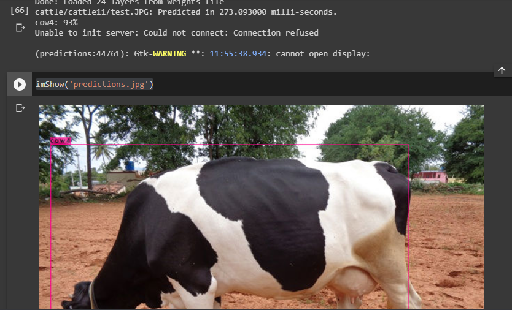
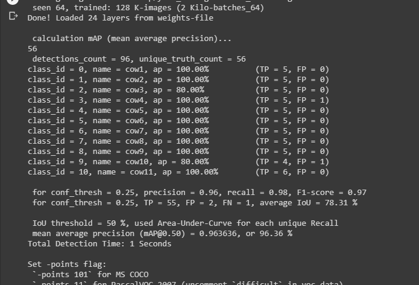

# Cattle detection using Tiny Yolo_V3 based on DarkNet

In this project, we use Yolo_v3 object detection model to detect cattle of Herd size 11, i.e cattles of 11 different classes, and try to predict the sample image to detect the class and localize the cattle object. We follow the below mentioned steps before training the model.
 
 1. Create custom cattle dataset either by downloading the images or by manually taking photos and annotate them by using LabelImg tool
 
 2. Divide the dataset into train test format
 
 3. Calculate the anchor boxes for the dataset and edit the configuraton file according to number of classes, anchor box values
 
 4. Zip the prepared data such as training data, cfg file, obj.names, obj.data text files of train and test data. Upload them to Google Colab and train the model
 
 5. Inference the model on a sample test image and calculate mAP (mean average precision) for all the classes as the final step
 

### Step1: 
Here the downloaded images are annotated using LabelIMg tool and are put under data the folder in cattle11.zip. As we annotate each images, we get the corresponding .txt file that has 
respective annotations. The number of classes required are mentioned in class_list file and is put under data conversion folder

### Step2:
In this step we split the data into train and test images. Run, process.py file and it will split the data and create two txt files, train and test in train-test conversion folder

### Step3:
We need to calculate anchor boxes, hence run the anchor.py file in anchor calulation folder. It calculates anchor boxes using K-means clustering and saves it as a txt file

### Step4:
In colabdata11 folder we edit the Yolov3_configuration.cfg file according to calculated anchor boxes and edit the number of filters required according to no. of classes based on the 
formula (n+5)*3. Here the no. of classes are 11, hence the number 48. Copy the train and test file from train-test conversion folder and put it under colabdata11 and edit the path 
according to path in Google colab. For e.g /content/darknet/cattle/cattle11/data/DSC00640.JPG. Create obj. data and obj.names files as mentioned in colabdata11 folder along with data,
train and test txt files and zip it and upload it to Google drive. 

Open Colab and mount the Google drive and start training the model. After every 1000 epochs it will automatically saves the .weights files under backup folder in the runtime
One the training is done for 3000-4000 epochs, we can stop it and inference on the sample image and calculate mean average precision(mAP) to calculate the performance of the model.

### This is how it looks like once the sample image is infernence after training

### Calculation of mAP

